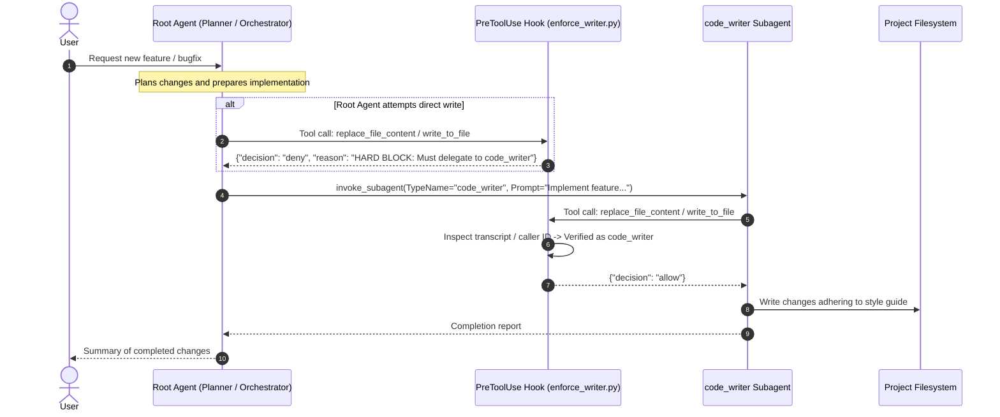

# Code Writer Kit (`code-writer-kit`)

**Code Writer Kit** is an Antigravity plugin and governance toolkit that enforces strict repository code quality, typing standards, and architectural hygiene by ensuring that all file write operations are delegated to a specialized `code_writer` subagent.

---

## Table of Contents

1. [Overview](#overview)
2. [How It Works](#how-it-works)
3. [Modular Style Skills](#modular-style-skills)
4. [Agent Interaction & Delegation Workflow](#agent-interaction--delegation-workflow)
5. [Installation](#installation)
   - [Option 1: Quick Install Scripts](#option-1-quick-install-scripts)
   - [Option 2: Python CLI Installer](#option-2-python-cli-installer)
   - [Option 3: Git Submodule (Workspace Scope)](#option-3-git-submodule-workspace-scope)
   - [Option 4: Explicit Registration in `plugins.json`](#option-4-explicit-registration-in-pluginsjson)
6. [Plugin Directory Structure](#plugin-directory-structure)
7. [Verification & Testing](#verification--testing)
8. [Configuration & Customization](#configuration--customization)
9. [Uninstallation](#uninstallation)

---

## Overview

When building complex software systems with autonomous agents, having unstructured writes directly from the root reasoning agent can lead to inconsistencies in formatting, missing docstrings, lax type annotations, and monolithic functions.

**`code-writer-kit` solves this by introducing a deterministic lifecycle gate**:
- File writing tools (`replace_file_content` and `write_to_file`) are intercepted by a **`PreToolUse` hook**.
- Direct write attempts by the root agent are **hard-blocked** with actionable error messages.
- Modifications are permitted only when executed by the dedicated **`code_writer` subagent** which dynamically loads the relevant modular style skills (e.g. `skills/python-style/SKILL.md`).

---

## How It Works



---

## Modular Style Skills
 
Style guides are organized as modular skills under `skills/` (for example, `skills/python-style/SKILL.md`). When invoked, the `code_writer` subagent inspects its available skills and loads the relevant style guidelines for the target language.
 
Key Python coding standards defined in `skills/python-style/SKILL.md` include:
 
1. **Top-Down Sequential Ordering**: Place public classes and callers first, with private helpers immediately below their callers.
2. **Modularity & Single Responsibility**: Concise functions with explicit call-site parameter extraction rather than monolithic context passthrough.
3. **DRY & Cross-Module Sharing**: Single authoritative modules for constants, schemas, and helpers.
4. **Error Visibility**: Domain-specific custom exceptions; no swallowed errors or arbitrary default fallbacks.
5. **Strict Typing**: 100% static type coverage without bare `Any` or untyped signatures.
6. **Context-Rich Documentation**: Google-style additive docstrings explaining design rationale and invariants.
7. **Targeted Verification**: Fast static checks and isolated unit tests over monolithic test suites.

---

## Agent Interaction & Delegation Workflow

### 1. Root Agent Protocol

When an agent needs to create or modify code files:

1. **Invoke the Subagent**:
   The `code_writer` subagent is pre-defined by the plugin and can be invoked directly:
   ```json
   {
     "TypeName": "code_writer",
     "Role": "Code Writer",
     "Prompt": "Implement feature X in file Y adhering strictly to repository style guidelines."
   }
   ```

---

## Installation

### Option 1: Quick Install Scripts

#### Windows (PowerShell)
```powershell
# Global Installation (Default: ~/.gemini/config/plugins/code-writer-kit)
.\install.ps1

# Workspace Installation (.agents/plugins/code-writer-kit)
.\install.ps1 -Workspace

# Symbolic Link (Live development)
.\install.ps1 -Symlink
```

#### macOS / Linux (Bash)
```bash
# Global Installation
./install.sh

# Workspace Installation
./install.sh --workspace

# Symbolic Link
./install.sh --symlink
```

---

### Option 2: Python CLI Installer

```bash
# Global installation (copies to ~/.gemini/config/plugins/code-writer-kit)
python install.py --global

# Workspace installation (copies to .agents/plugins/code-writer-kit)
python install.py --workspace

# Development symlink
python install.py --global --symlink
```

---

### Option 3: Git Submodule (Workspace Scope)

To bundle `code-writer-kit` directly within your project repository:

```bash
git submodule add <repo-url> .agents/plugins/code-writer-kit
```

Antigravity automatically discovers and loads plugins placed in `.agents/plugins/`.

---

### Option 4: Explicit Registration in `plugins.json`

If storing `code-writer-kit` in a custom path, reference it in `.agents/plugins.json` or `~/.gemini/config/plugins.json`:

```json
{
  "plugins": [
    "/absolute/path/to/code-writer-kit"
  ]
}
```

---

## Plugin Directory Structure

```text
code-writer-kit/
├── .gitignore               # Standard ignore patterns
├── README.md                # Comprehensive documentation
├── plugin.json              # Antigravity plugin manifest
├── hooks.json               # PreToolUse lifecycle hook specification
├── install.py               # Python installer CLI
├── install.ps1              # Windows PowerShell 1-step installer
├── install.sh               # macOS/Linux Bash 1-step installer
├── agents/
│   └── code_writer/
│       └── agent.md         # Pre-defined code_writer subagent manifest & instructions
├── rules/
│   └── AGENTS.md            # Active rules merged into agent context
├── scripts/
│   └── enforce_writer.py    # PreToolUse gate script
└── skills/
    └── python-style/
        └── SKILL.md         # Modular Python coding standards & architectural rules
```

---

## Verification & Testing

To verify that the hook functions properly, run the included hook validation logic:

```python
import subprocess
import json

payload_denied = {
    "transcriptPath": "fake.jsonl",
    "toolCall": {
        "name": "write_to_file",
        "args": {"TargetFile": "sample.py"}
    }
}

proc = subprocess.Popen(
    ["python", "scripts/enforce_writer.py"],
    stdin=subprocess.PIPE,
    stdout=subprocess.PIPE,
    text=True
)
out, _ = proc.communicate(json.dumps(payload_denied))
print(out)  # Outputs: {"decision": "deny", "reason": "..."}
```

---

## Configuration & Customization

### Enabling or Disabling
You can toggle the plugin globally or per workspace via `config.json`:

```json
{
  "plugins": {
    "code-writer-kit": {
      "enabled": true
    }
  }
}
```

### Customizing Style Rules
To adjust rules (e.g. max function length, docstring formats) or add standards for other languages, modify `skills/python-style/SKILL.md` or add new skill directories under `skills/`.

---

## Uninstallation

To remove the plugin and disable it in configuration:

```bash
# Python
python install.py --uninstall

# PowerShell
.\install.ps1 -Uninstall

# Bash
./install.sh --uninstall
```

---

## License

MIT License. Copyright (c) 2026.
