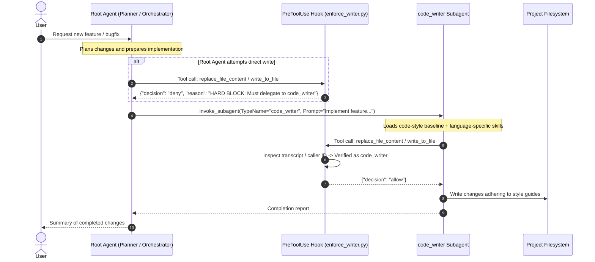

# Code Writer Kit (`code-writer-kit`)

**Code Writer Kit** is an Antigravity plugin and governance toolkit that enforces strict repository code quality, typing standards, and architectural hygiene by ensuring that all file write operations are delegated to a specialized `code_writer` subagent.

---

## Table of Contents

1. [Overview](#overview)
2. [How It Works](#how-it-works)
3. [Modular Multi-Skill Architecture](#modular-multi-skill-architecture)
4. [Agent Interaction & Delegation Workflow](#agent-interaction--delegation-workflow)
5. [Installation](#installation)
   - [Option 1: Quick Install Scripts](#option-1-quick-install-scripts)
   - [Option 2: Python CLI Installer](#option-2-python-cli-installer)
   - [Option 3: Git Submodule (Workspace Scope)](#option-3-git-submodule-workspace-scope)
   - [Option 4: Explicit Registration in `plugins.json`](#option-4-explicit-registration-in-pluginsjson)
6. [Plugin Directory Structure](#plugin-directory-structure)
7. [Verification & Testing](#verification--testing)
8. [Configuration & Customization](#configuration--customization)
9. [Uninstallation](#uninstallation)

---

## Overview

When building complex software systems with autonomous agents, having unstructured writes directly from the root reasoning agent can lead to inconsistencies in formatting, missing docstrings, lax type annotations, and monolithic functions.

**`code-writer-kit` solves this by introducing a deterministic lifecycle gate**:
- File writing tools (`replace_file_content` and `write_to_file`) are intercepted by a **`PreToolUse` hook**.
- Direct write attempts by the root agent are **hard-blocked** with actionable error messages.
- Modifications are permitted only when executed by the dedicated **`code_writer` subagent** which dynamically loads the mandatory baseline `code-style` skill and relevant language-specific style skills (e.g. `skills/python-style/SKILL.md`).

---

## How It Works



---

## Modular Multi-Skill Architecture

Style guides and architectural standards are organized into a layered, modular skill hierarchy under `skills/`:

### 1. Mandatory Skill Loading Protocol

Whenever the `code_writer` subagent is invoked, it must adhere to a strict multi-skill loading protocol before modifying code:
1. **Always Load Baseline `code-style` Skill**: For **ANY** code modification, the subagent MUST load the baseline `code-style` skill (`skills/code-style/SKILL.md`) from its Available skills list.
2. **In Addition, Load Language-Specific Skills**: IN ADDITION to `code-style`, the subagent MUST ALSO load the corresponding language-specific skill(s) for the target files being modified (such as `python-style` for Python files via `skills/python-style/SKILL.md`, `typescript-style` for TypeScript files, etc.).
3. **Workspace Augmentations**: If workspace-specific style skills or workspace root style guidelines (e.g., `<workspace_root>/style_guide.md` or `<workspace_root>/.agents/style_guide.md`) are present, load and augment the guidelines with them, giving project-specific rules precedence in case of conflict.

---

### 2. Baseline Standards (`skills/code-style/SKILL.md`)

Language-agnostic architectural invariants required for all code modifications:
- **Modularity & Single Responsibility**: Concise functions (typically under 25–30 lines of logic) with explicit call-site parameter extraction rather than passing monolithic configuration/context down into leaf helpers.
- **DRY & Single Source of Truth**: Centralize shared constants, schemas, models, and subroutines in dedicated authoritative modules; no duplicate definitions.
- **Error Visibility & Propagation**: Custom domain exceptions, transparent error propagation, no swallowed exceptions or silent fallback defaults.
- **Data Migration Over Application Workarounds**: Maintain strict schemas and perform one-time data migrations instead of adding runtime backward-compatibility shims.
- **Direct Expressions & Inline Flow**: Direct `return`/`yield` statements, prohibition of single-use intermediate variable aliases for object attributes.
- **Avoid Magic Numbers & Hardcoded Constants**: Top-level named constants and structured enumerations instead of scattered raw values.
- **Targeted Verification vs. Monolithic Test Suites**: Fast static checks and isolated unit tests; never run monolithic full-repo test suites locally.

---

### 3. Language-Specific Standards (e.g., `skills/python-style/SKILL.md`)

Python-specific standards layered on top of the baseline:
- **Top-Down Sequential Ordering**: Public callers placed first, private helper functions placed immediately below their callers, `from __future__ import annotations` at the top of every module.
- **Strict Typing**: 100% static type hint coverage on all parameters and return types without bare `Any`.
- **Context-Rich Google Docstrings**: Additive docstrings with `Args:`, `Returns:`, and `Raises:` providing operational rationale.
- **Logger & Constant Naming**: `_ALL_CAPS` for internal module constants, `ALL_CAPS` for exported public constants, structured `StrEnum` classes, and lowercase `logger = logging.getLogger(__name__)`.
- **Fast Static Verification**: Targeted checks (`ruff`, `pyright`, `mypy`) and isolated unit tests.

---

## Agent Interaction & Delegation Workflow

### 1. Root Agent Protocol

When an agent needs to create or modify code files:

1. **Invoke the Subagent**:
   The `code_writer` subagent is pre-defined by the plugin and can be invoked directly:
   ```json
   {
     "TypeName": "code_writer",
     "Role": "Code Writer",
     "Prompt": "Implement feature X in file Y adhering strictly to repository style guidelines."
   }
   ```

---

## Installation

### Option 1: Quick Install Scripts

#### Windows (PowerShell)
```powershell
# Global Installation (Default: ~/.gemini/config/plugins/code-writer-kit)
.\install.ps1

# Workspace Installation (.agents/plugins/code-writer-kit)
.\install.ps1 -Workspace

# Symbolic Link (Live development)
.\install.ps1 -Symlink
```

#### macOS / Linux (Bash)
```bash
# Global Installation
./install.sh

# Workspace Installation
./install.sh --workspace

# Symbolic Link
./install.sh --symlink
```

---

### Option 2: Python CLI Installer

```bash
# Global installation (copies to ~/.gemini/config/plugins/code-writer-kit)
python install.py --global

# Workspace installation (copies to .agents/plugins/code-writer-kit)
python install.py --workspace

# Development symlink
python install.py --global --symlink
```

---

### Option 3: Git Submodule (Workspace Scope)

To bundle `code-writer-kit` directly within your project repository:

```bash
git submodule add <repo-url> .agents/plugins/code-writer-kit
```

Antigravity automatically discovers and loads plugins placed in `.agents/plugins/`.

---

### Option 4: Explicit Registration in `plugins.json`

If storing `code-writer-kit` in a custom path, reference it in `.agents/plugins.json` or `~/.gemini/config/plugins.json`:

```json
{
  "plugins": [
    "/absolute/path/to/code-writer-kit"
  ]
}
```

---

## Plugin Directory Structure

```text
code-writer-kit/
├── .gitignore               # Standard ignore patterns
├── README.md                # Comprehensive documentation
├── plugin.json              # Antigravity plugin manifest
├── hooks.json               # PreToolUse lifecycle hook specification
├── install.py               # Python installer CLI
├── install.ps1              # Windows PowerShell 1-step installer
├── install.sh               # macOS/Linux Bash 1-step installer
├── agents/
│   └── code_writer/
│       └── agent.md         # Pre-defined code_writer subagent manifest & instructions
├── rules/
│   └── AGENTS.md            # Active rules merged into agent context
├── scripts/
│   └── enforce_writer.py    # PreToolUse gate script
└── skills/
    ├── code-style/
    │   └── SKILL.md         # Baseline coding standards & architectural invariants
    └── python-style/
        └── SKILL.md         # Python-specific coding standards & conventions
```

---

## Verification & Testing

To verify that the hook functions properly, run the included hook validation logic:

```python
import subprocess
import json

payload_denied = {
    "transcriptPath": "fake.jsonl",
    "toolCall": {
        "name": "write_to_file",
        "args": {"TargetFile": "sample.py"}
    }
}

proc = subprocess.Popen(
    ["python", "scripts/enforce_writer.py"],
    stdin=subprocess.PIPE,
    stdout=subprocess.PIPE,
    text=True
)
out, _ = proc.communicate(json.dumps(payload_denied))
print(out)  # Outputs: {"decision": "deny", "reason": "..."}
```

---

## Configuration & Customization

### Enabling or Disabling
You can toggle the plugin globally or per workspace via `config.json`:

```json
{
  "plugins": {
    "code-writer-kit": {
      "enabled": true
    }
  }
}
```

### Customizing Style Rules
To adjust baseline rules, modify `skills/code-style/SKILL.md`. To adjust language-specific rules or add standards for other languages, modify `skills/python-style/SKILL.md` or add new skill directories under `skills/` (e.g. `skills/typescript-style/SKILL.md`).

---

## Uninstallation

To remove the plugin and disable it in configuration:

```bash
# Python
python install.py --uninstall

# PowerShell
.\install.ps1 -Uninstall

# Bash
./install.sh --uninstall
```

---

## License

MIT License. Copyright (c) 2026.
